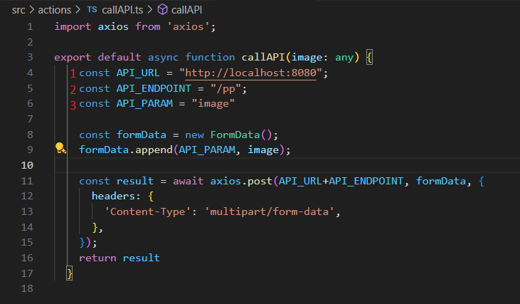

# React API call example
 A simple react frontend that makes a call on an endpoint that expects some image as input.

### Installing dependencies and Configuration:
-  Install [node.js](https://nodejs.org/en)
- Open the terminal on this project root folder and type "npm install"
- To run the frontend, simply type "npm start" on the project root folder.

    If you don't have and API built in to rest this frontend, there is a simple python fastAPI on this project on the folder "API", to run it, you'll need:
- Install [Python](https://www.python.org)
- install the dependencies opening the terminal in the "API" folder and typing "pip install -r requirements.txt"
- Run the "app.py" file and the API should be running at the port 8080 on your localhost.

    If you already have some API build in and want it to test on the frontend, you need to modify the "./src/actions/callAPI.ts" file accordingly to your API information:
    

How to use the Frontend:
    Run the frontend by the "npm start" command and open the "localhost:3000" on your browser and test it from there.